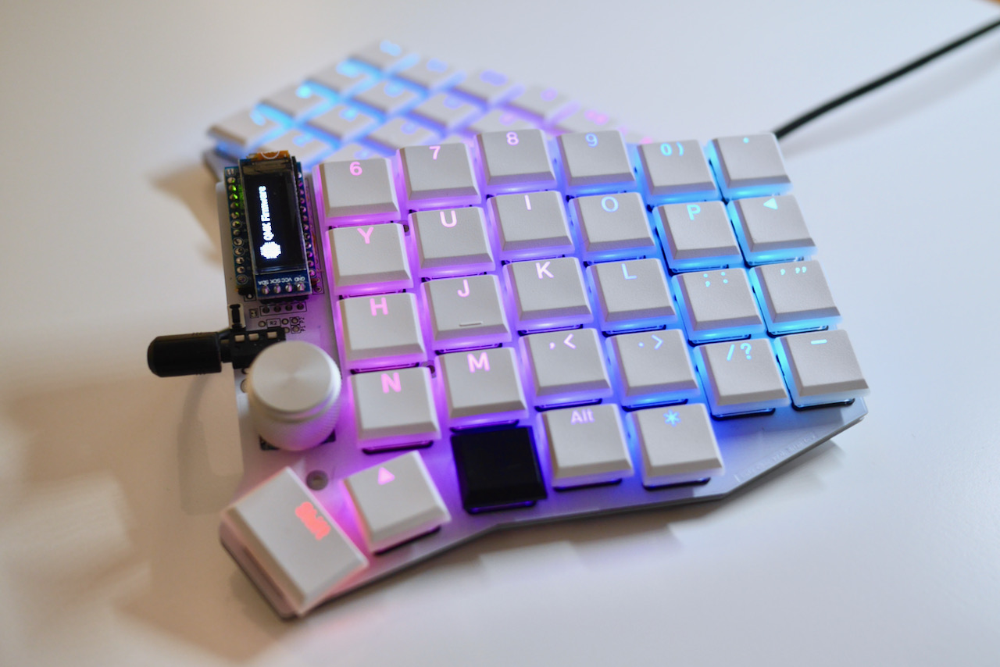
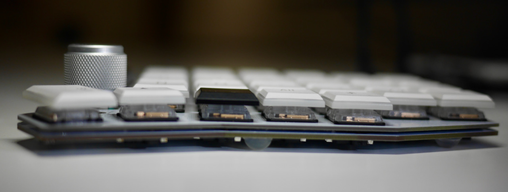
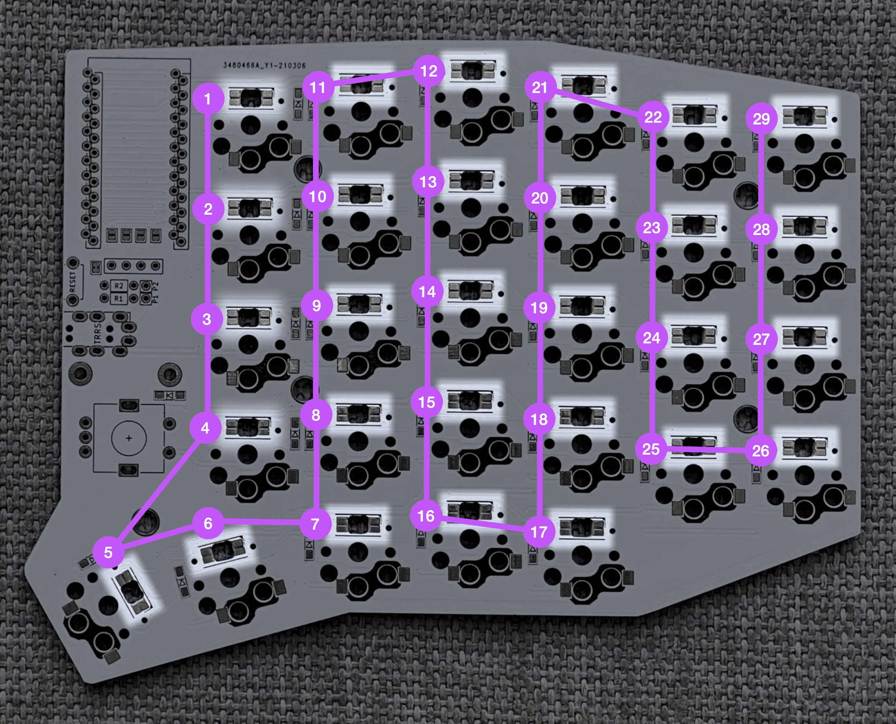
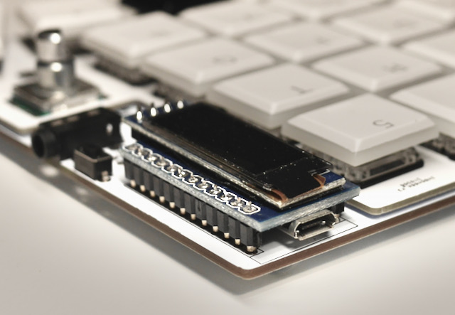
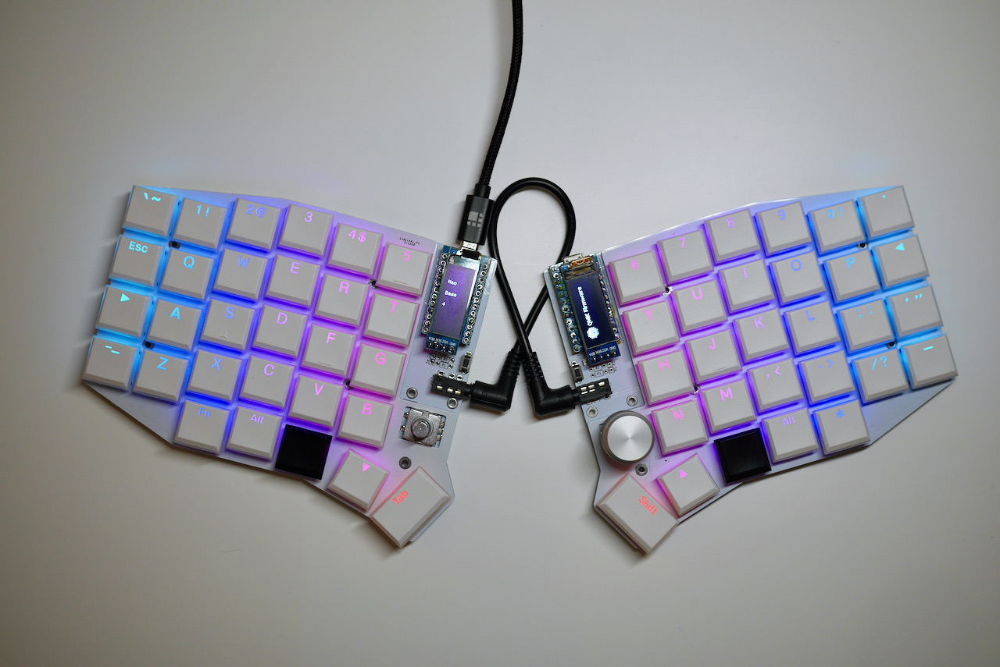
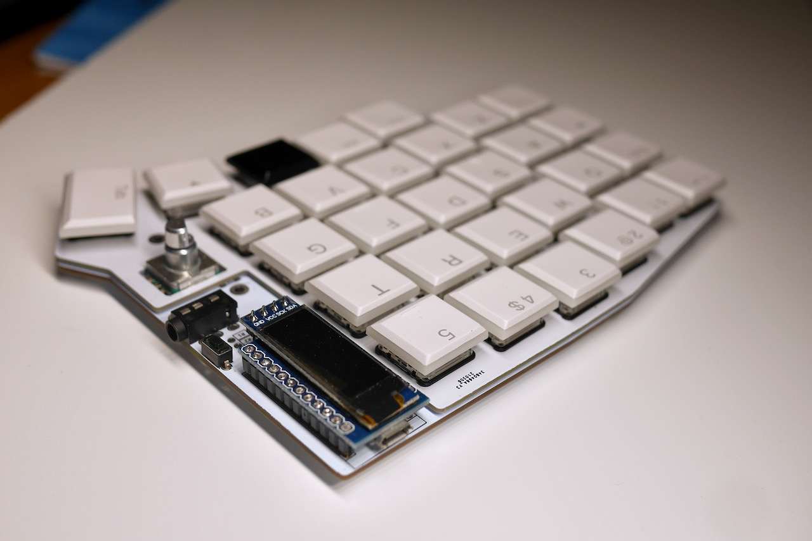

The Sofle Choc is a variation of the Sofle with:

   - low-profile, Kailh Choc switches
   - hotswap sockets
   - per-key RGB
   - thin, 15mm from desktop to top of keycaps
   - Sofle v2 switch layout with the more aggressive pinky stagger

This version supports any [Kailh Choc v1 switches](https://deskthority.net/wiki/Kailh_PG1350_series). Kailh hotswap sockets are required. Per-key RGB is optional and uses the relativey easy to solder SK6812 MINI-E LEDs.

The top plates are not compatible with Sofle v1, v2 or RGB versions. There is no bottom plate to minimize thickness.

The Sofle Choc was designed by [Brian Low](https://github.com/brianlow) and based on the excellent Sofle RGB by [Dane Evans](https://github.com/DaneEvans) which was based on the original Sofle v2 by [Josef Adamčík](https://github.com/josefadamcik).

## Bill of materials

The following is needed to build the keyboard:

- **2 PCBs**. Send the zip from `/Gerbers/Choc_v2/choc-v2-gerber-pcb.zip` to a PCB fabrication service. I used JLCPCB's defaults setting only customizing the PCB color and surface finish. See [sourcing][sourcing].

- **2 top plates**. Send the zip `/Gerbers/Choc_v2/choc-v2-gerber-top.zip` to a PCB fabrication service. The top plate holds the switches in place. See [sourcing][sourcing].

- **2 Pro Micro** boards or clones. 5v, 2x12 pins, ATmega32U4 microcontroller. **Don't** buy the Arduino Micro (a different pinout) or Arduino Mini (different microcontroller). You could also use Elite-C which basically Pro Micro wi	th USB-C.

- **4x12 pin header (and optional sockets)** for Pro Micros. There are several ways how to mount Pro Micros to the board. Either the male pin headers you most likely got with the board from the supplier could be used to solder it directly to the board. Build guides for Helix, Corne and Lily58 suggest [those spring pin headers][springpinheader] which are very compact and give you non-permanent connection (you can remove or replace Pro Micros). I used the diode legs approach [described at splitkb.com][promicrosocketing] with an ED5624-ND socket (Digi-Key part 115-93-624-41-003000).

- **58 Kailh Choc keyboard switches**. Must be [Kailh Choc v1 switches (PG1350)](https://deskthority.net/wiki/Kailh_PG1350_series) of any color. The `PG` prefix is often omitted. **Don't** buy [Kailh Choc v2](https://deskthority.net/wiki/Kailh_PG1353_series), [Kailh Mini Choc](https://deskthority.net/wiki/Kailh_PG1232_series) or [Cherry MX](https://deskthority.net/wiki/Cherry_MX).

- **58 Kailh Choc keyboard switch sockets**. Sockets are specific to the PG1350 switch. The PCB requires sockets. Switches cannot be soldered directly to the board.

- **58 keycaps**. You can use either all in `1u` size but it looks nicer with two `1.5u` for the thumb keys.

- **58 diodes 1N4148W**. Surface mount diodes in SOD123 package. Pick any common variation. I used `1N4148WTR` (Digi-Key 1655-1360-1-ND).

- **2 TRRS connectors**. The same type which is used for Corne, Lily58 etc. Technically even TRS should work if you stick to the default serial communication.

- **2 buttons** momentary, tactile, through-hole, 2 pins, I used one for DIP switches, 3x6x4.3mm. Technically optional: you can use metal tweezers whenever you need to reset the microcontroller.

- **1 TRRS cable**. TRS should work if you stick with the default serial communications.

- **8 - 10 silicone bumpers**. Used for feet to keep the keyboard from moving

- **Micro USB Cable** to connect the keyboard to a computer.

Optional components:

- **OLED/s**
  - **2 SSD1306 128x32 OLED display module**. 4-pin, I2C, 0.91". Very common.
  - **2x 4 pin header (and optionally socket)** for OLEDs. These came pre-soldered to the OLED unit. Ideally, use a socket but the common 1x4 female pin sockets are quite tall and would need remove the any pre-soldered pins.
  - **2 OLED covers** This should be compatible with the Sofle RGB cover but have not verified

- **Rotary encoders**
  - **2 Rotary encoders EC11**. If you are not sure take EC11E. Some other variants (EC11K) may have some additional plastic pins for and require mounting holes for them which are not included on the PCB. Perfer short shaft. I used encoders with 10mm, D-shaped shaft and 30 positions from AliExpress. I also tried a high quality Bourns encoder (PEC11 series) but found it required a bit too much effort to twist.
  - **2 matching knobs** for each encoder. Make sure the knob matches the encoder's shaft diameter, depth and shape.

- **LEDs**
  - **58 SK6812 MINI-E RGB LEDs**. The LED body 3.2x2.8x1.7mm and with legs is 5.8x2.8. Avoid the non-MINI-E version without the legs. Purchase extra as they are delicate. I ended up replacing 6 during my build.

Components that are common on other Sofle variants but are **not** used on this Softle Choc: bottom plate, M2 spacers, M2 spacers

## Tools and materials

- soldering iron
- solder
- no-clean flux makes soldering easier
- good tweezers
- masking tape
- isopropyl-alcohol for cleaning
- screwdriver

## Steps

Building a Sofle Choc is simiar to the Sofle and Sofle RGB. This guide is abreviated to cover mostly the differences. Refer to the [Sofle build guide](/docs/build_guide.md) for more details.

### Prepare

Make sure you know which side you are working on, and don't make two left hand sides by mistake.

The order of assemby does not matter **except** for these 3 components because they stack on top of one another:
  1. the four OLED jumpers
  2. the Pro Micro
  3. the OLED screen

The remaining components I generally install shortest to tallest so the board lays flat making soldering easier. You can also install a few components at time and test along the way.

Components installed on the back of the PCB:
  - switch sockets
  - diodes
  - LEDs

Components installed on the front:
  - everything else

### Switch Sockets and Diodes

These components are placed on the back of the PCB.

Diodes must be oriented with the white band in the direction of the "arrow" symbol on the PCB. I typically tin one pad, place the diode on, apply the soldering iron to the diode leg until it melts the solder underneath and sinks flush with the PCB. Then come back and solder the other leg.

The sockets are the largest and easiest to solder. They are installed on the back of the PCB facing up towards the front of the PCB. Make sure they are flush with the PCB.

### The LEDs

LEDs are placed on the back of the PCB. The lens should point up through the PCB so they shine into the bottom of the switch. One leg will have a diagonal cut. This cut leg should be aligned with the triangular marking on the PCB.

To solder: tin one pad, place the LED and hold using tweezers, apply heat to the leg until the solder melts and the LED is flush with the board. Now the remaining legs can be soldered without the component moving. The LEDs are sensitive to heat. Let the LED cool between soldering each leg. Use the lowest heat needed for your solder.

The LEDs are wired in one long chain. If a LED is not working, replace the LED and the LED preceeding it. Sometimes just the output a LED is damaged. The full chain does not need to be installed if you want to test a partially built board.

### OLED Jumpers

These jumpers should be bridged if using an OLED dispay. The jumpers may not be accessible later in the build depending on how the Pro Micro is attached.

### Pro Micro and OLED

The Pro Micro must be installed upside down: with the components facing the PCB and the plain back facing out.
Make sure that you use the through holes with the outline marks on whichever side of the board that you mount the micro on.

Install the OLED so it overhangs the Pro Micro. I added electrican's tape to the bottom of the OLED module where it might contact the Pro Micro.

### Keyboard switches and plates

- Mount the stand-offs to the top plate.

- Snap first switches into corners of the plate.

- Carefully snap the first switches to the sockets. Be careful so you don't bend their contacts.

- Add the rest of the switches

### Finishing touches

- Install the rotary encoder knob.

- Optionally add oled covers

- Put at least 4 adhesive rubber feet in the corners so the keyboard is not moving when you type.

## Warnings and disclaimers

- Don't connect or disconnect the TRRS cable when the keyboard is powered. It may short out. Always disconnect the USB cable first.
- Be gentle with micro USB ports on your microcontrollers. They are easy to break.
- Keep in mind that this is a prototype of a DIY keyboard. It's not a polished product.

## Firmware and programming

The Sofle Choc uses [QMK Firmware][qmk_firmware]. Support is not in the main QMK repository yet. Instead use the [brianlow/qmk_firmware](https://github.com/brianlow/qmk_firmware) fork.

Suggested approach is to build the firmware yourself. You should be familiar with QMK and be able to make it work on your local environment. If not, please [follow the instructions in the documentation][qmkintro]. Note QMK setup is fairly invasive (upgrade every homebrew package on your system) so you might want to consider the [QMK Docker image](https://beta.docs.qmk.fm/using-qmk/guides/development-environments/getting_started_docker) for compiling.

To flash:

- Clone [https://github.com/brianlow/qmk_firmware](https://github.com/brianlow/qmk_firmware)
- Switch to the `choc` branch with `git checkout choc`
- Make sure your QMK environment [is setup][qmkintro].
- Make sure halves are not connected together with TRRS cable.
- Connect one half to USB, flash the firmware (always follow the actuall instructions in the QMK documentation! The command might look something like this: `qmk flash -kb sofle/rev1 -km choc`). Use the reset button to reset the keyboard when you are asked to in console. Some Pro Micros require double-clicking the reset button to enter bootloader mode.-
- Connect the second half and flash it in the same way as the previous one.
- Disconnect the USB cable. Connect both halves together with TRRS cable.
- Connect USB cable to the **left** side.
- Enjoy SofleKeyboard!

There is also a firmware version that uses [VIA](https://caniusevia.com/). VIA allows you to quickly change your keymap without flashing or a QMK build environment. I highly recommend it for experimenting. The two downsides is it doesn't support custom logic like a key for switching betwen Mac/Win and the exporting/importing keymaps has some problems with some multi-chord keys though typically you don't need to export/import.

To use the VIA firmware

- Clone https://github.com/brianlow/qmk_firmware
- Switch to the `choc_brian` branch with `git checkout choc`
- When flashing use the `choc_brian` keymap: `qmk flash -kb sofle/rev1 -km choc_brian`
- Download the VIA app from https://caniusevia.com/, it should recognize the keyboard when it opens

## Troubleshooting

See the Sofle build guide.

## Links

- [Github with KiCad projects][soflegithub]
- [Layout in KeyboardLayout editor][soflelayout]
- [QMK Firmware][qmk_firmware]
- [QMK Configurator][qmk_configurator]

## Default layout

The default layout for the Sofle is in the qmk repo, and demonstrates some LED functions.

## Images of keyboard

## Footnotes
[layoutarticle]: <https://josef-adamcik.cz/electronics/in-search-of-the-best-custom-keyboard-layout.html> "In search of the best custom keyboard layout"
[introductionarticle]: <https://josef-adamcik.cz/electronics/let-me-introduce-you-sofle-keyboard-split-keyboard-based-on-lily58.html> "Let me introduce you SofleKeyboard - a split keyboard based on Lily58 and Crkbd"
[soflelayout]: http://www.keyboard-layout-editor.com/#/gists/76efb423a46cbbea75465cb468eef7ff "Sofle Keyboard layout at keyboard-layout-editor.com"
[soflegerber]: https://github.com/josefadamcik/SofleKeyboard/releases "SofleKeyboard - gerber files"
[qmk_firmware]: https://github.com/qmk/qmk_firmware/ "QMK firmware"

[qmk_configurator]: https://config.qmk.fm/#/sofle/rev1/LAYOUT "QMK configurator"
[springpinheader]: <https://yushakobo.jp/shop/a01mc-00/> "Spring pin headers - Japaneese"
[qmkprotonc]: https://qmk.fm/proton-c/ "QMK Proton-C"
[promicrosocketing]: <https://docs.splitkb.com/hc/en-us/articles/360011263059> "How do I socket a microcontroller? by splitkb.com"
[qmkintro]: <https://beta.docs.qmk.fm/newbs/newbs_getting_started> "QMK getting started"
[qmkhandedness]: <https://docs.qmk.fm/#/feature_split_keyboard?id=setting-handedness> "QMK firmware - setting handedness"
[manufacturingproblems]: https://josef-adamcik.cz/electronics/corne-keyboard-build-log.html#manufacturing-at-jlcpcb---update-27112019 "Possible problems when manufacturing top plate for Corne"
[nooledlag]: https://github.com/qmk/qmk_firmware/issues/7522 "No OLED lag bug"
[soflegithub]: https://github.com/josefadamcik/SofleKeyboard "SofleKeyboard - KiCad project on Github.com"
[sourcing]: <{{ site.baseurl }}/sourcing_parts.html> "Sourcing parts"
