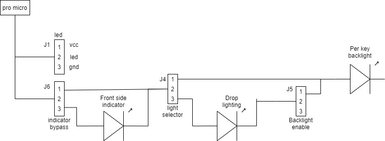
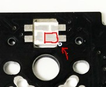
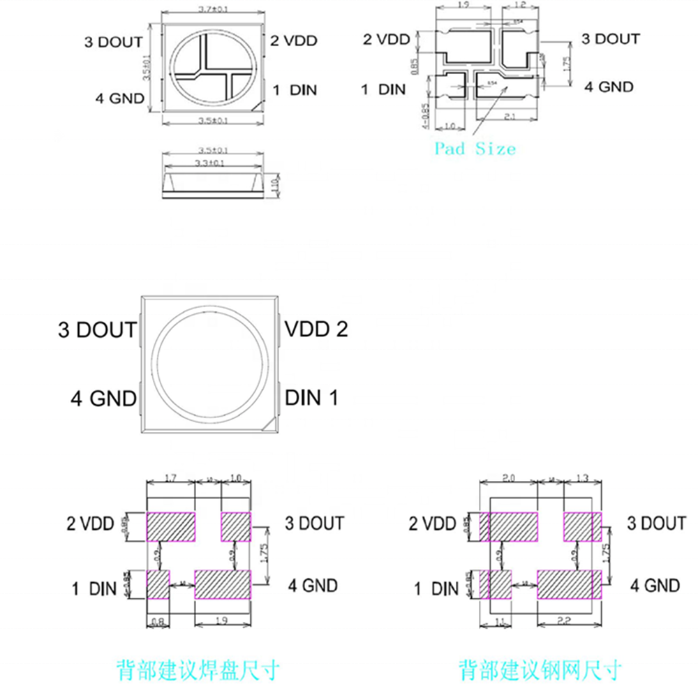
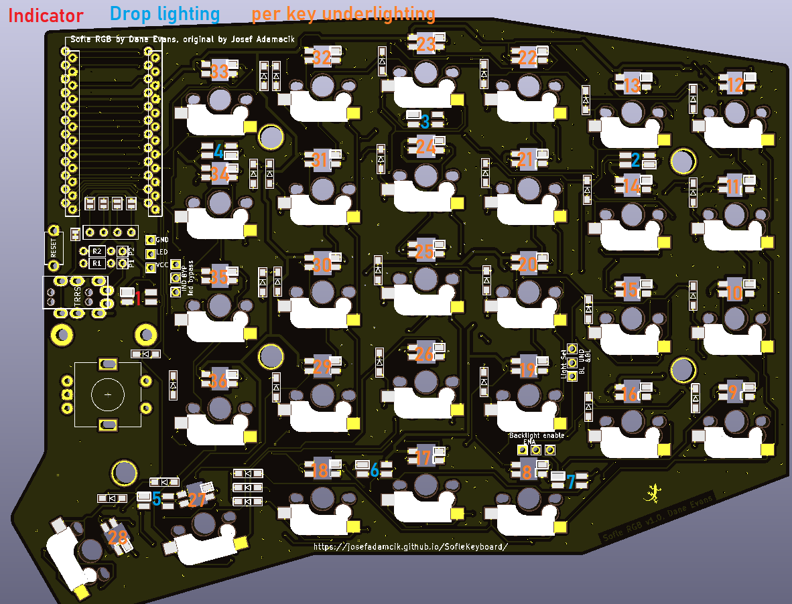
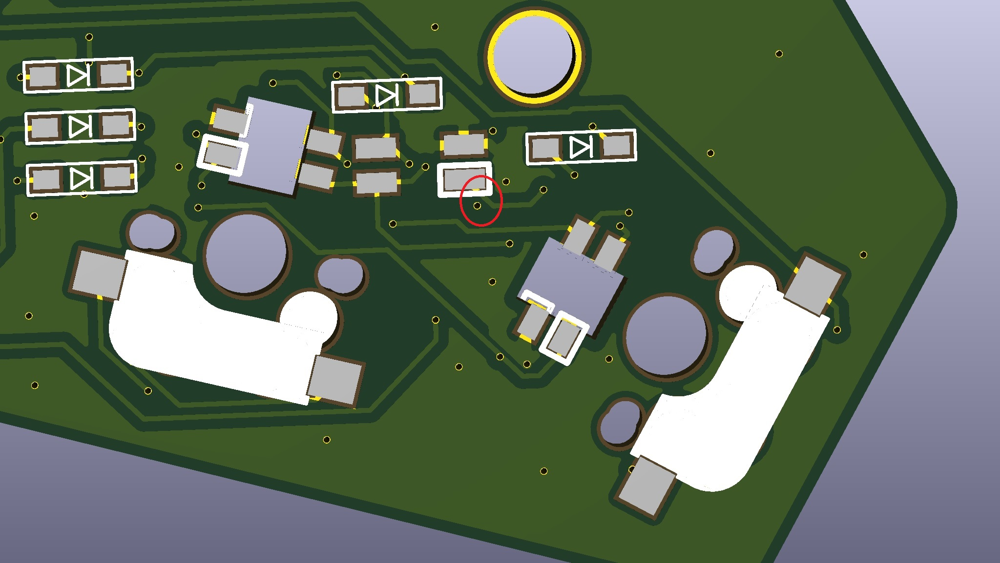
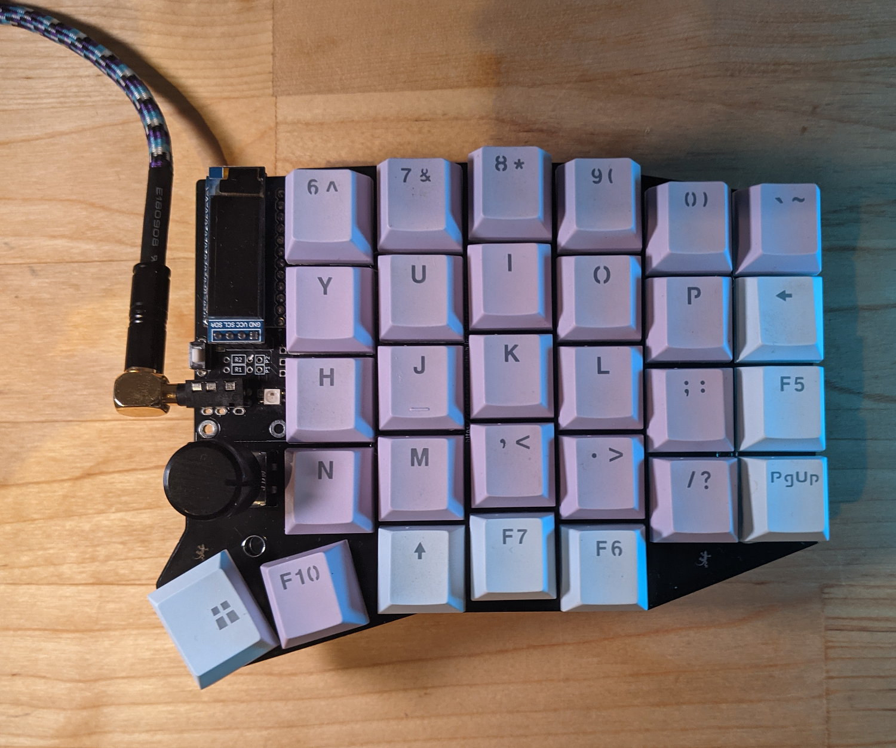

The Sofle RGB is a copy of the Sofle V2 with the addition of up to 36 RGB leds per side. If you are just looking to try out that layout, and are using the cherry sockets only, then this will work for you. Please mind that the layout has slight modifications, mainly the pinkie stagger is less aggresive than for non-RGB Sofle V2.

This version rolls back the original pro-micro pinout (to the state it was for V1) and improves routing.

## This Build Guide

This build guide is based on a copy of the main [build guide][buildguide]. We suggest to revisit the main [build guide][buildguide] for general process and tips about technique. But this build guide is the main source of importand details for your build - like Pro-Micro orientation, component placement etc.

**&#9888; Keyhive version: Pay attention, if you purchased Sofle RGB from Keyhive**

One keyboard vendor - Keyhive - is selling their own fork of Sofle RGB. This version is **modified** in way that makes it **incompatible** with the **firmware** for the official designs. Also this build guide no longer applies to their version. 

**&#9888; If you purchased their modified version, you have to use the firmware provided by the vendor and [the build guide provided by them as well][keyhivebuildguide].**

Please, don't report problems with the desing by Keyhive and or firmware to the official Sofle Keyboard repository. Their modification is not part of the repository and therefore we can't fix any problems and we can't help with any problems you might have with the design. Contact the vendor instead. In the end, you are their client.

## Bill of materials

The following is needed to build the keyboard.

- **2 PCBs**, ** NOTE: ** There is an issue with the v2.0 boards. See the Troubleshooting section at the bottom of the page for further details if you were unlucky enough to get a board made with these files. 
- **2 top plates**, **2 bottom plates** for a sandwich-case build.

- **2 Pro Micro** board or clone. With 2x12 pins and ATmega32U4 microcontroller. Just make sure you **don't** buy something like Arduino Micro (a different pinout) or Arduino Mini (different microcontroller). You could also use Elite-C which basically Pro Micro with USB-C.
- **4x12 pin header (and optionally socket)** for Pro Micros. There are several ways how to mount Pro Micros to the board. Either the male PIN headers you most likely got with the board from the supplier could be used to solder it directly to the board. Build guides for Helix, Corne and Lily58 suggest [those spring pin headers][springpinheader] which are very compact and give you non-permanent connection (you can remove or replace Pro Micros). Another possible approach [is described at splitkb.com][promicrosocketing].

- **58 keyboard switch sockets by Kailh**. The PCB supports sockets for traditional MX switches. They are available on Aliexpress, KBDFans and others.
- **58 keyboard switches** of your preference, MX. Just make sure you have matching sockets for them.
- **58 keycaps**. You can use either all in `1u` size but it looks nicer with two `1.5u` for the thumb keys.
- **58 diodes  1N4148W**. They are surface mount diodes in SOD123 package.
- **2 TRRS connectors**. The same type which is used for Corne, Lily58 etc. Technically even TRS should work[^1] if you stick to (default) serial communication. 
- **2 tactile buttons** through-hole, 2 pins. Technically optional: you can use metal tweezers whenever you need to reset the microcontroller. There's also a reset key on default layout so as long as you have firmware flashed and working you shouldn't need reset button on the board. 
- **1 TRRS cable**. TRS should work if you stick with Serial. 
- **10 (+4) M2 spacers**. 10 are going to hold the bottom and the top together. Their height depends on which switches you use. A build guide Lily58 Pro suggests  `7mm` for MX. I was not able to get `7mm`, but `6mm` worked well for me with MX switches. I used brass ones but you can also buy nicer from anodised aluminium. 
- **20 (+8) M2 screws**. 20 are going to hold the boards together (via spacers). I used some I had in my stock so I am not going to tell you exact length. But they need to be long enough to fix a `1.6mm` thick PCB to the spacer and short enough so two of them can fit in one spacer (might be trickier with 4mm spacers for Choc switches)
- **8 - 10 adhesive rubber feet**. They are really important, trust me.
- **Micro USB Cable** to connect the keyboard to a computer.

**Optional**
- **OLED/s**
	- **2 ssd1306 128x32 OLED display module**. Very common everywhere. 
	- **2x 4 pin header (and optionally socket)** for OLEDs. I have used the most common 1x4 female pin sockets which are quite tall but they also fit the height of ProMicro with the sockets I have used. Unfortunately, the pin headers on my OLED modules (again those very common square male headers you would get with the modules) are loose in the sockets. It works but it's fiddly. I'll have to find a better solution.
	- **2 OLED cover** This is available in [the repository (oled_cover.svg)](https://github.com/josefadamcik/SofleKeyboard/tree/master/Sofle_RGB/Case/)
	
- **Rotary encoders**
	- **2 Rotary encoders EC11**, If you are not sure take EC11E. Some other variants (EC11K) may have some additional plastic pins for and require mounting holes for them (which are not included on the PCB).
	- **A matching knob** for each encoder. 
	
- **LEDs**
	- **SK6812 mini rgb leds (3.5mmx3.5mm size)** make sure that you get the style with irregular shaped pads that are flush to the led, and make very sure that you know what the pinout for your variant is. There are at least  2 common pinouts, thankfully just rotated 180 degrees, but for you the pin 1 marking may be on pin 3.
		- **1x forward facing layer indicator**
		- **6x rear facing drop lights**
		- **29x per key lights** 

## Tools and materials

- soldering iron
- solder 
- good tweezers
- masking tape
- isopropyl-alcohol for cleaning
- screwdriver

## Steps

### Prepare

Make sure you know which side you are working on, and don't make two left hand sides by mistake 

### The LEDs

Work out what leds you wish to have, I have endeavoured  to provide plenty of flexibility, and all led configurations are available using the headers available. If you wish to experiment, use 2.54mm headers and jumpers. If you know what you want, use a solder bridge to enable the leds required.  
The traditional LED header is available, and can be used alone, or theoretically fed back in to one of the other headers if so desired. 

Make sure you know which way around your leds are, different brands have different pin 1 positions. Thankfully it appears that the pad pattern underneath is consistent, so use it. I recommend doing one LED and testing it before continuing. This unfortunately suggests soldering the micro on first, despite it making the back side harder to solder. A good alternative would be to use an existing keyboard with leds to inject the signal and power through the LED header.

#### LED pinouts

The above picture is from the crkbd guide shows pin 4 on the table (the table is viewed from the top of the LED). 

**The sofle RGB uses the following table, with the silkscreen marking at pin 1 (Dout)**
| pin | net | net | pin |
| --- | --- | --- | --- |
| 1 | Dout | Vcc | 4 | 
| 2 | Gnd  | Din | 3 | 

Using the base pattern is the only consistent pattern between at least two different models with different pin 1 definitions and markings.

The following two datasheet excerpts show two versions of the led with different numbering pattern. But shows the same layout and net labels on the bottom.

**Soldering** 

The surface mount LEDs are easier to solder, and there are only 1+6 of them on each side, so are a good place to start if you aren't used to soldering them. Use a fairly low temperature (240c) and lots of flux. Place the led in position, heat one of the pads on the board for several seconds before moving the iron to touch the pin on the led , then add solder. Moving the iron back and forth from the pin can help to flow the solder under the LED, 

I have added a single LED to the top surface to act as a layer indicator, this is enabled by bridging 2-3 on J6(indicator bypass).

To enable drop lighting, short pins 2-3 of J4(Light select), to enable only per key lighting short pins 1-2 of J4. 
If you wish to use per key lighting, you also need to short pins 1-2 of 5. 

| Indicator | Drop lighting | Per key 	| j6(Ind Bypass) 	| j4(Light select) 	|j5(Backlight) 	| 
| :---: | :---: | :---: | :---: | :---: | :---: |
|  N  |  N  |  N  |     |	|     |
|  N  |  N  |**Y**| 1-2 | 1-2 	|     |
|  N  |**Y**|  N  | 1-2 | 2-3 	|     |
|  N  |**Y**|**Y**| 1-2 | 2-3	| 1-2 |
|**Y**|  N  |  N  | 2-3 |	|     |
|**Y**|  N  |**Y**| 2-3 | 1-2 	|     |
|**Y**|**Y**|  N  | 2-3 | 2-3 	|     |
|**Y**|**Y**|**Y**| 2-3 | 2-3	| 1-2 |

The per key lighting is painful and slow. For these it is definitely best to do them in order, and test regularly. Use as low a temperature as you can manage, place the board flat on a table, and drop an led in. Create a solder bridge from the led to the board, not spending too much time with the iron on the led (few seconds) otherwise it will burn out. 

If the part of the string stops working, resolder the last working one, and the first to fail, then if needed replace them. 

#### LED Layouts 
** Indicator + drop lighting  **

** Indicator + per key lighting  **

** Indicator + drop lighting + per key lighting **

### Components on the backside

- Start with the diodes. Make sure you have orientation right - they are all oriented to the same side. The end with the thin line is Cathode (-) and it should go in the direction of the "arrow" symbol on the PCB.

- Sockets for switches belong again on the back side, the same side as diodes. Make sure they are flush with PCB and match the orientation shown on the silkscreen. 

### Bridge the oled pads
This is done on the top side, all 4 solder bridges must be completed. This is easier before the pro micro headers are soldered 

### Components on the front side

- Button and TRRS sockets belong to the top. Use a piece of tape to fix them and apply solder from the bottom side.

### Pro Micro and displays

- The pro micro must be installed with the components facing the pcb, and the plain back side facing out. Theoretically I think these could be installed on the under side for a lower profile. 

Make sure that you use the outlined headers from whichever side of the board that you mount the micro on. 

- Install the oled so it sits over the pro micro 

### Rotary encoders

- Add rotary encoders last, they are big, and make soldering harder 

### Keyboard switches and plates

- Mount the stand-offs to the top plate.

- Snap first switches into corners of the plate.

- Carefully snap the first switches to the sockets. Be careful so you don't bend their contacts.

- Add the rest of the switches

- Mount the bottom plate.

### Finishing touches

- Install the rotary encoder knob.

- Optionally add oled covers

- Put at least 4 adhesive rubber feet in the corners so the keyboard is not moving when you type.

## Warnings and disclaimers

- Don't connect or disconnect the TRRS cable when the keyboard is powered. It may short out. Always disconnect the USB cable first.
- Be gentle with micro USB ports on your microcontrollers. They are easy to break.
- Keep in mind that this is a prototype of a DIY keyboard. It's not a polished product.

## Firmware and programming

Sofle keyboard uses [QMK Firmware][qmk_firmware] and support for the board is part of the main QMK repository. There's also a basic support in [QMK Configurator][qmk_configurator] but there's no encoder  or led support.

Suggested approach is to build the firmware yourself. You should be familiar with QMK and be able to make it work on your local environment. If not, please [follow the instructions in the documentation][qmkintro].

- Make sure your QMK environment [is setup][qmkintro].
- Make sure halves are not connected together with TRRS cable.
- Connect one half to USB, flash the firmware (always follow the actuall instructions in the QMK documentation! The command might look something like this: `qmk flash -kb sofle/rev1 -km default`). Use the reset button to reset the keyboard when you are asked to in console. 
- Connect the second half and flash it in the same way as the previous one.
- Disconnect the USB cable. Connect both halves together with TRRS cable.
- Connect USB cable to the **left** side. 
- Enjoy SofleKeyboard!

## Troubleshooting

See the Sofle build guide.

**V2.0 Boards** - There is a known issue on V2.0 boards with the LED circuit - a trace is missing to a via on the underside of the board (on top on the left half)

Symptoms: only the first 4 underglow LEDs will work, this will occur on both halves of the board, 

Remedy: This can be easily corrected by adding a wire between the via and the trace immediately above it in the picture. You may need to scrape off the solder mask on the via depending on which manufacturer you used. 
The other end can either be attached to the trace (after removing some mask), or the footprint/led itself. 

This has been corrected in the v2.1 boards, and hopefully hasn't caught too many people out. Thanks to jmo808 for finding it, and apologies once again. 

## Links

- [Github with KiCad projects][soflegithub]
- [Layout in KeyboardLayout editor][soflelayout]
- [QMK Firmware][qmk_firmware]
- [QMK Configurator][qmk_configurator]

## Firmware 

SofleRGB uses [QMK firmware](https://qmk.fm/), it can use any Sofle keymap. 

## Default layout 

The default layout for the SofleRGB is in the qmk repo, and demonstrates some LED functions. 

## Images of keyboard

## Footnotes
[layoutarticle]: <https://josef-adamcik.cz/electronics/in-search-of-the-best-custom-keyboard-layout.html> "In search of the best custom keyboard layout"
[introductionarticle]: <https://josef-adamcik.cz/electronics/let-me-introduce-you-sofle-keyboard-split-keyboard-based-on-lily58.html> "Let me introduce you SofleKeyboard - a split keyboard based on Lily58 and Crkbd"
[soflelayout]: http://www.keyboard-layout-editor.com/#/gists/76efb423a46cbbea75465cb468eef7ff "Sofle Keyboard layout at keyboard-layout-editor.com"
[soflegerber]: https://github.com/josefadamcik/SofleKeyboard/releases "SofleKeyboard - gerber files"
[qmk_firmware]: https://github.com/qmk/qmk_firmware/ "QMK firmware"

[qmk_configurator]: https://config.qmk.fm/#/sofle/rev1/LAYOUT "QMK configurator"
[springpinheader]: <https://yushakobo.jp/shop/a01mc-00/> "Spring pin headers - Japaneese"
[qmkprotonc]: https://qmk.fm/proton-c/ "QMK Proton-C"
[promicrosocketing]: <https://docs.splitkb.com/hc/en-us/articles/360011263059> "How do I socket a microcontroller? by splitkb.com"
[qmkintro]: <https://beta.docs.qmk.fm/newbs/newbs_getting_started> "QMK getting started"
[qmkhandedness]: <https://docs.qmk.fm/#/feature_split_keyboard?id=setting-handedness> "QMK firmware - setting handedness"
[manufacturingproblems]: https://josef-adamcik.cz/electronics/corne-keyboard-build-log.html#manufacturing-at-jlcpcb---update-27112019 "Possible problems when manufacturing top plate for Corne"
[nooledlag]: https://github.com/qmk/qmk_firmware/issues/7522 "No OLED lag bug"
[soflegithub]: https://github.com/josefadamcik/SofleKeyboard "SofleKeyboard - KiCad project on Github.com"
[sourcing]: <{{ site.baseurl }}/sourcing_parts.html> "Sourcing parts"
[keyhivebuildguide]: <https://github.com/keyhive/build_guides/blob/master/docs/keyboards/sofle-rgb.md> "Sofle RGB Keyhive build guide"
[buildguide]: <{{ site.baseurl }}/build_guide.html> "Sofle V1/V2 build guide"
